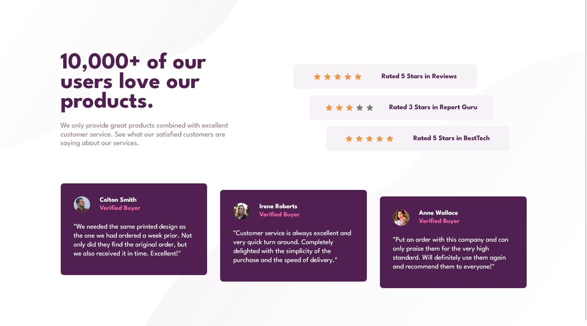

# Frontend Mentor - Social proof section solution

This is a solution to the [Social proof section challenge on Frontend Mentor](https://www.frontendmentor.io/challenges/social-proof-section-6e0qTv_bA). Frontend Mentor challenges help you improve your coding skills by building realistic projects. 

## Table of contents

- [Overview](#overview)
  - [The challenge](#the-challenge)
  - [Screenshot](#screenshot)
  - [Links](#links)
- [My process](#my-process)
  - [Built with](#built-with)
- [Author](#author)

## Overview

This project will test your layout skills. If you're starting to get confident with Flexbox or Grid, this will provide a nice challenge!

### The challenge

Your challenge is to build out this social proof section and get it looking as close to the design as possible.

Users should be able to:

- View the optimal layout for the section depending on their device's screen size

### Screenshot

### Links

- Solution URL: [https://github.com/mohamedKhaled89/single-price-grid-component]
- Live Site URL: [https://mohamedkhaled89.github.io/single-price-grid-component/]

## My process

### Built with

- Semantic HTML5 markup
- CSS custom properties
- Flexbox
- CSS Grid`

## Author

- Frontend Mentor - [@mohamedKhaled89](https://www.frontendmentor.io/profile/mohamedKhaled89)
